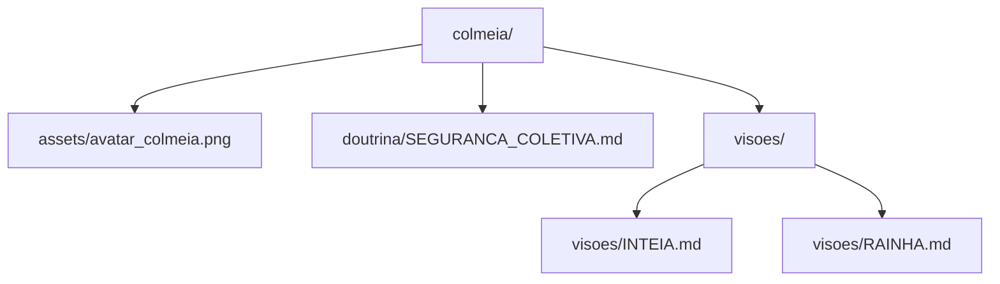

# 00_MAPA_GPS.md - Pasta colmeia

Mapa de navegacao local da pasta `colmeia/`.

## Navegacao por intencao

1. Visao estrategica INTEIA: `colmeia/visoes/INTEIA.md`
2. Visao simbolica/identitaria: `colmeia/visoes/RAINHA.md`
3. Doutrina de seguranca coletiva: `colmeia/doutrina/SEGURANCA_COLETIVA.md`
4. Asset principal: `colmeia/assets/avatar_colmeia.png`

