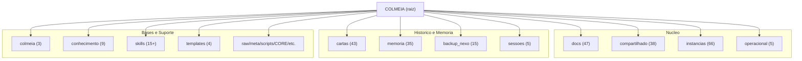
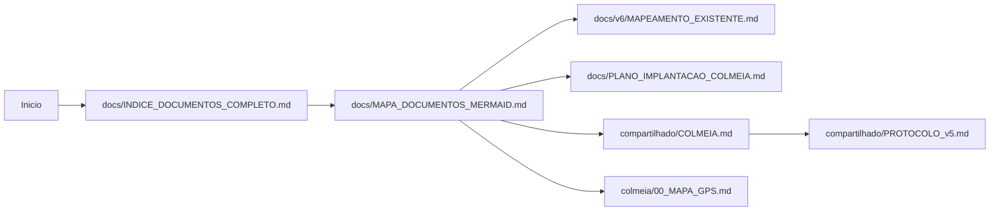
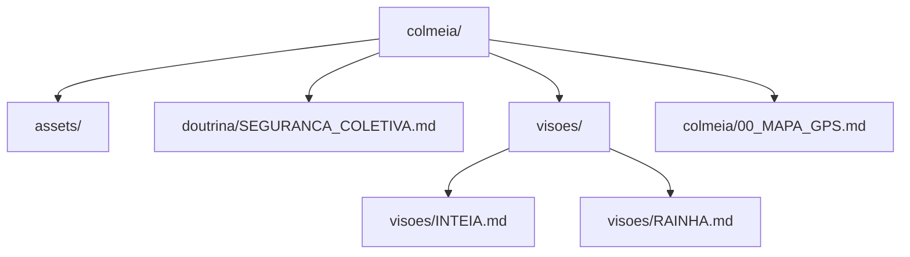

# Mapa de Documentos (Mermaid)

Fonte de verdade do inventario: `docs/INDICE_DOCUMENTOS_COMPLETO.md`.

---

## 1) Mapa Global do Repositorio

---

## 2) Mapa de Navegacao Operacional

---

## 3) Mapa Focado na Pasta `colmeia/`

---

## 4) Rotas Rapidas

1. Inventario completo: `docs/INDICE_DOCUMENTOS_COMPLETO.md`
2. Mapa legado v6: `docs/v6/MAPEAMENTO_EXISTENTE.md`
3. Arquitetura ecossistema: `compartilhado/COLMEIA.md`
4. Protocolo unificado: `compartilhado/PROTOCOLO_v5.md`
5. Mapa local da pasta Colmeia: `colmeia/00_MAPA_GPS.md`

