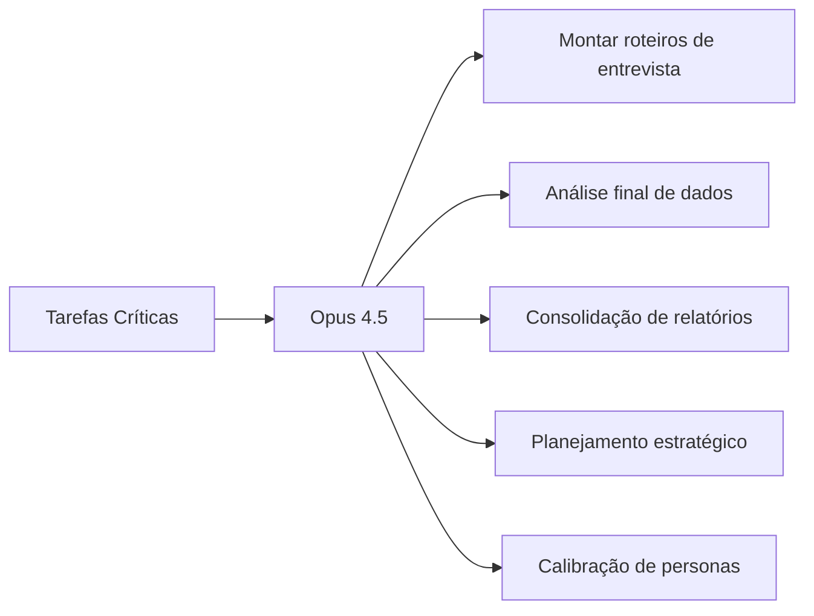
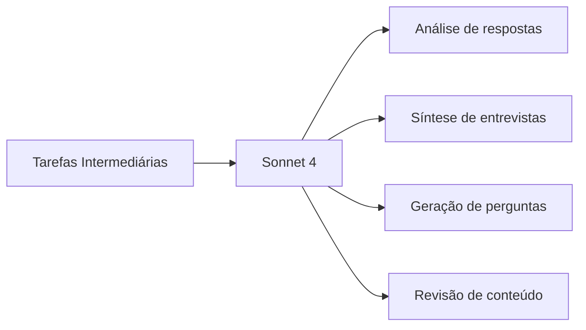
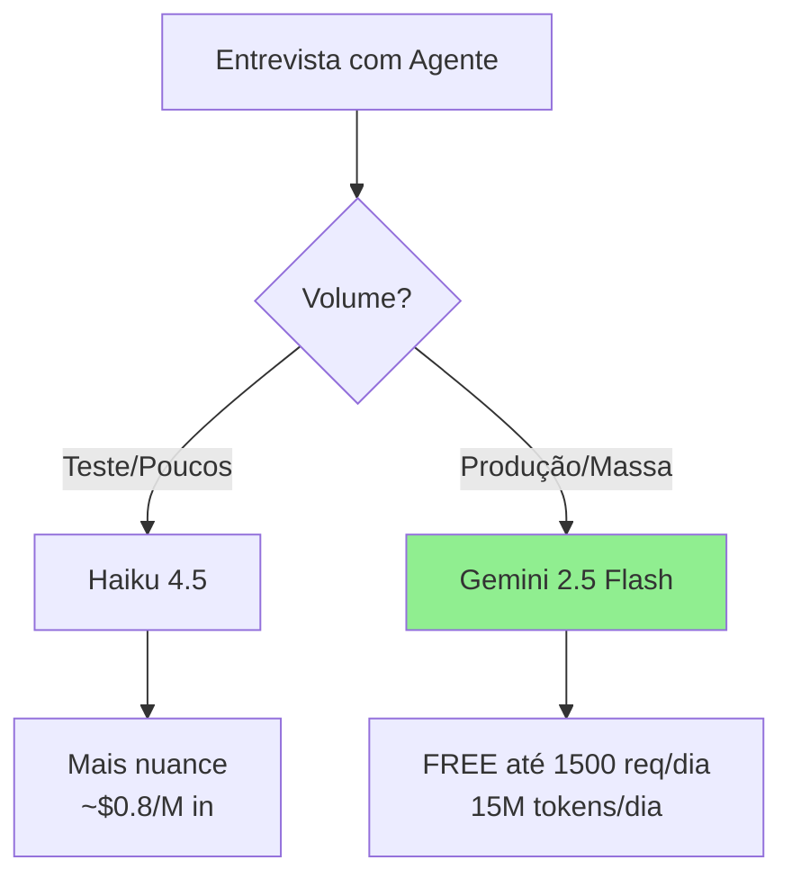
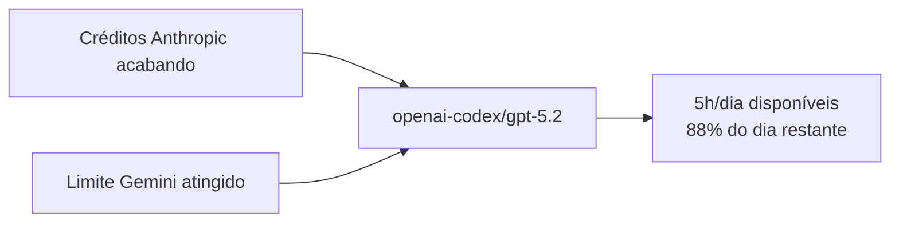
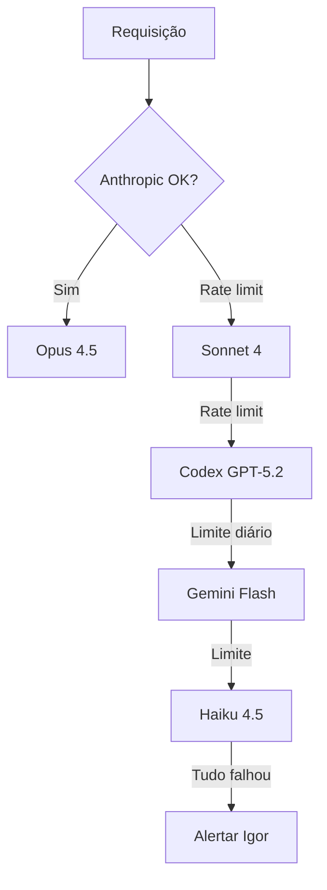

# 🎯 Roteamento de Modelos por Caso de Uso

> Configuração otimizada para INTEIA - Pesquisa Eleitoral DF 2026
> Última atualização: 2026-02-04

## 📊 Matriz de Custos e Capacidades

```mermaid
quadrantChart
    title Custo vs Inteligência
    x-axis Baixo Custo --> Alto Custo
    y-axis Baixa Int. --> Alta Int.
    
    quadrant-1 Premium (Alta Int, Alto Custo)
    quadrant-2 Sweet Spot (Alta Int, Baixo Custo)
    quadrant-3 Budget (Baixa Int, Baixo Custo)
    quadrant-4 Evitar (Baixa Int, Alto Custo)
    
    Opus 4.5: [0.9, 0.95]
    Sonnet 4: [0.5, 0.8]
    Haiku 4.5: [0.25, 0.6]
    Gemini Flash: [0.1, 0.65]
    GPT-5.2 Codex: [0.15, 0.75]
```

## 🎭 Modelos por Tarefa (Pesquisa Eleitoral)

### 1. ALTA INTELIGÊNCIA (poucos tokens)
**Usar: `anthropic/claude-opus-4-5`**



**Custo:** ~$75/M input, $150/M output
**Quando usar:** Decisões que impactam todo o sistema

---

### 2. TAREFAS MÉDIAS (tokens moderados)
**Usar: `anthropic/claude-sonnet-4`**



**Custo:** ~$3/M input, $15/M output
**Quando usar:** Qualidade importa mas volume é médio

---

### 3. SIMULAÇÃO DE AGENTES (MUITOS tokens)
**Usar: `google/gemini-2.5-flash` ou `anthropic/claude-3-5-haiku-latest`**



**Por que Gemini Flash para massa:**
- FREE tier: 1500 requisições/dia, 1M tokens/min
- Contexto de 1M tokens (cabe histórico completo)
- Suficiente para simular respostas de eleitores

**Por que Haiku para testes:**
- Mais "personalidade" que Gemini
- Melhor para calibrar antes de escalar

---

### 4. FALLBACK DE EMERGÊNCIA (créditos acabando)
**Usar: `openai-codex/gpt-5.2` (via ChatGPT OAuth)**



**Status atual:** 5h de uso, 100% disponível
**Renovação:** Diária

---

## ⚙️ Configuração Recomendada

### Para Clawdbot (uso geral)
```json
{
  "agents": {
    "defaults": {
      "model": {
        "primary": "anthropic/claude-opus-4-5",
        "fallbacks": [
          "anthropic/claude-sonnet-4",
          "openai-codex/gpt-5.2",
          "google/gemini-2.5-flash",
          "anthropic/claude-3-5-haiku-latest"
        ]
      }
    }
  }
}
```

### Para Simulação de Agentes (API direta)
```python
# Configuração por tipo de tarefa
MODEL_CONFIG = {
    # Alta inteligência, baixo volume
    "design_entrevista": "anthropic/claude-opus-4-5",
    "analise_final": "anthropic/claude-opus-4-5",
    "calibracao_persona": "anthropic/claude-opus-4-5",
    
    # Média inteligência, médio volume  
    "sintese_respostas": "anthropic/claude-sonnet-4",
    "geracao_perguntas": "anthropic/claude-sonnet-4",
    
    # Simulação em massa (PRINCIPAL CUSTO)
    "resposta_agente": "google/gemini-2.5-flash",  # FREE
    "resposta_agente_calibracao": "anthropic/claude-3-5-haiku-latest",
    
    # Fallback emergencial
    "fallback": "openai-codex/gpt-5.2"
}
```

---

## 💰 Estimativa de Custos (1000 agentes, 10 perguntas cada)

| Etapa | Modelo | Tokens | Custo |
|-------|--------|--------|-------|
| Design (1x) | Opus 4.5 | ~10k | ~$1.50 |
| Perguntas (10x) | Sonnet 4 | ~50k | ~$0.75 |
| Respostas (10k) | Gemini Flash | ~5M | **FREE** |
| Análise (1x) | Opus 4.5 | ~100k | ~$15 |
| **TOTAL** | | | **~$17** |

Se usasse Opus para tudo: **~$750** 😱

---

## 🔧 IDs de Modelo (Clawdbot)

| Alias | ID Completo | Uso |
|-------|-------------|-----|
| opus | `anthropic/claude-opus-4-5` | Tarefas críticas |
| sonnet | `anthropic/claude-sonnet-4` | Tarefas médias |
| haiku | `anthropic/claude-3-5-haiku-latest` | Testes/calibração |
| flash | `google/gemini-2.5-flash` | Simulação em massa |
| codex | `openai-codex/gpt-5.2` | Fallback gratuito |

---

## 🚨 Regras de Fallback



---

*Documento gerado por NEXO para uso da INTEIA*
