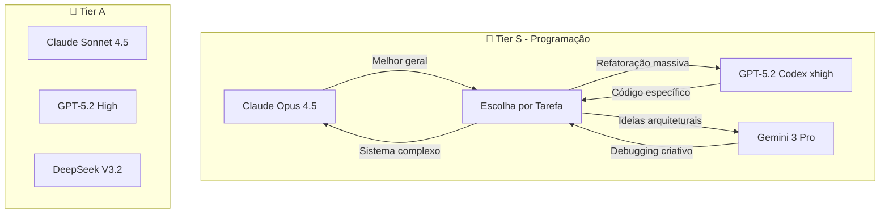
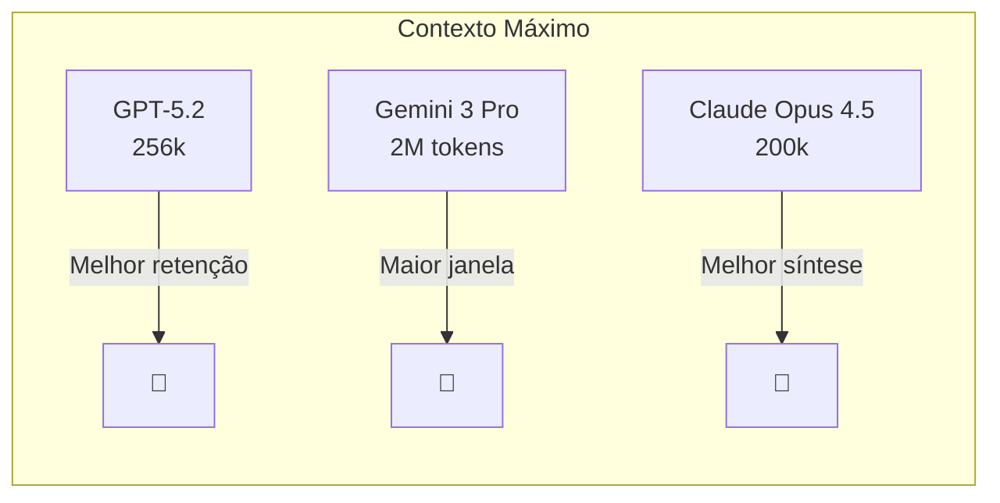
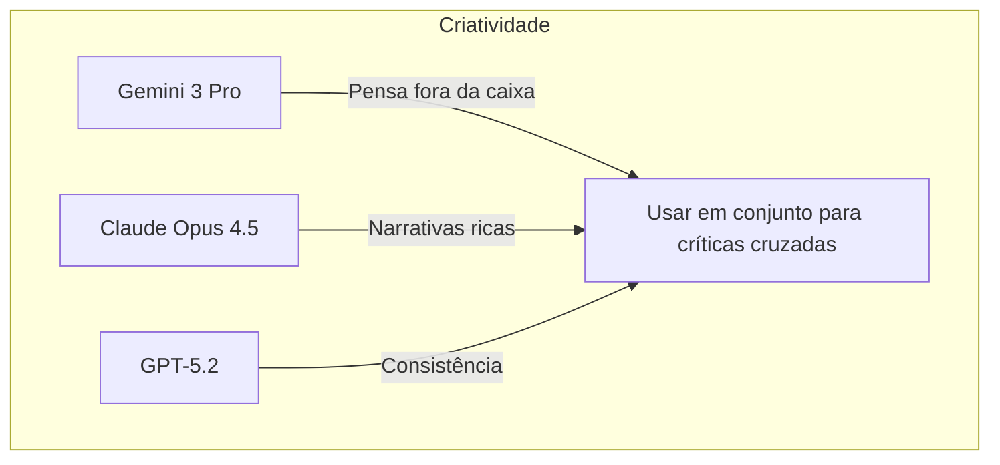
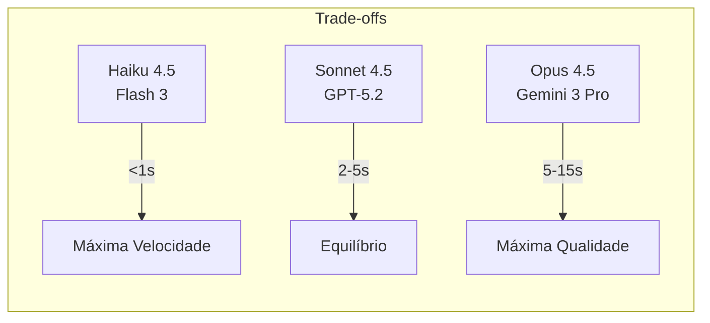
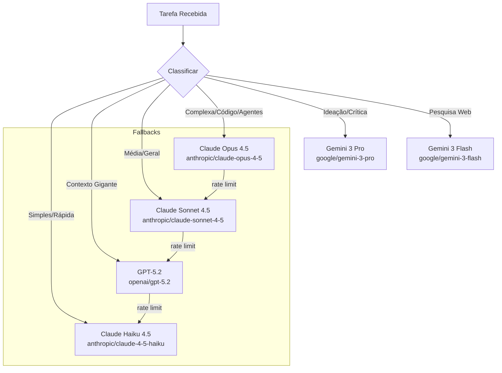
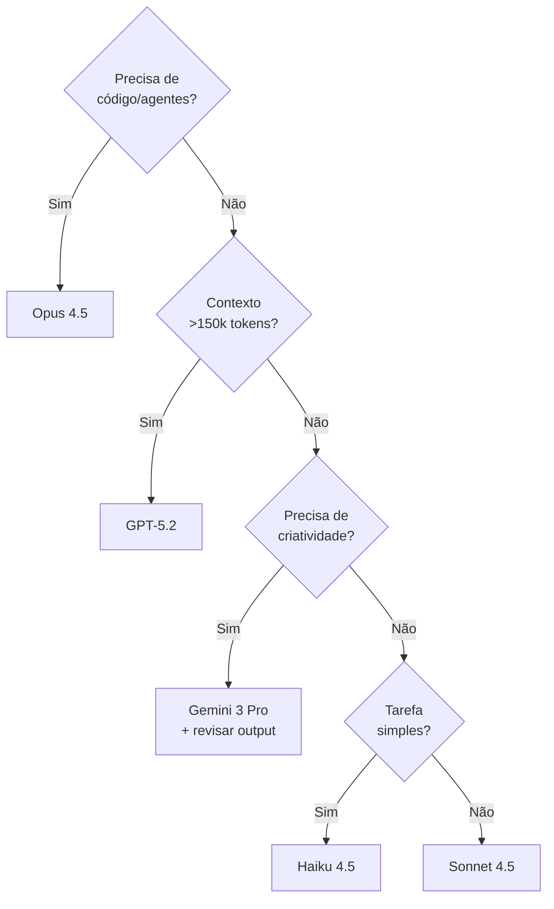

# 🧠 Guia de Seleção de Modelos de IA - Estado da Arte 2026

> Última atualização: 2026-02-04
> Fonte: Arena AI Leaderboard + Artificial Analysis + Experiência Igor

## 📊 Rankings Globais (Arena AI - Fev 2026)

| Rank | Modelo | Provider | Força Principal |
|------|--------|----------|-----------------|
| 1 | Gemini 3 Pro | Google | Raciocínio, Pesquisa, Criatividade |
| 2 | Grok 4.1 Thinking | xAI | Raciocínio profundo |
| 3 | Gemini 3 Flash | Google | Velocidade + Qualidade |
| 4 | Claude Opus 4.5 (thinking) | Anthropic | Programação, Sistemas Agênticos |
| 5 | Claude Opus 4.5 | Anthropic | Personalidade, Operações |
| 8 | GPT-5.1 High | OpenAI | Contexto longo, Equilíbrio |
| 10 | Claude Sonnet 4.5 (thinking) | Anthropic | Custo-benefício |
| 20 | GPT-5.2 | OpenAI | Contexto longo |
| 21 | GPT-5.2 High | OpenAI | Máxima capacidade OpenAI |
| 57 | Claude Haiku 4.5 | Anthropic | Velocidade extrema |

---

## 🏆 Melhores por Categoria

### 💻 Programação & Sistemas Agênticos


### 📚 Contexto Longo (>100k tokens)


### 🎨 Criatividade & Ideação


### ⚡ Velocidade vs Qualidade


---

## 🔧 Configuração Recomendada para Clawdbot

### Modelos por Função



### IDs de Modelo (API)

| Uso | Provider | Model ID | Thinking |
|-----|----------|----------|----------|
| **Principal Clawdbot** | Anthropic | `anthropic/claude-opus-4-5` | ✅ Disponível |
| **Tarefas Médias** | Anthropic | `anthropic/claude-sonnet-4-5` | ✅ Disponível |
| **Tarefas Rápidas** | Anthropic | `anthropic/claude-4-5-haiku` | ❌ |
| **Contexto Longo** | OpenAI | `openai/gpt-5.2` | Via xhigh |
| **Máximo OpenAI** | OpenAI | `openai/gpt-5.2-xhigh` | ✅ |
| **Código OpenAI** | OpenAI | `openai/gpt-5.2-codex-xhigh` | ✅ |
| **Criatividade** | Google | `google/gemini-3-pro` | Preview |
| **Velocidade Google** | Google | `google/gemini-3-flash` | ✅ |

---

## 📈 Pontos Fortes por Provider

### Anthropic (Claude)
```
✅ Programação e debugging
✅ Sistemas agênticos (seguir instruções complexas)
✅ Personalidade e nuance
✅ Operações e ações
✅ Mais rápido que GPT-5.2 para mesma qualidade
⚠️ Contexto menor que Gemini
```

### OpenAI (GPT-5.x)
```
✅ Contexto longo com boa retenção
✅ Equilibrado na maioria das tarefas
✅ Codex para código especializado
✅ Estável e previsível
⚠️ Mais lento que Claude
⚠️ Menos personalidade
```

### Google (Gemini 3)
```
✅ #1 no Arena geral!
✅ Contexto de 2M tokens
✅ Pensamento lateral/criativo
✅ Excelente para pesquisa
✅ Bom custo-benefício
⚠️ ALUCINA - revisar outputs sempre
⚠️ Inconsistente (sacadas geniais + besteiras)
```

---

## 🎯 Decisão Rápida



---

## ⚙️ Config para Clawdbot

### Config Atual (só Anthropic autenticada)

```json
{
  "agents": {
    "defaults": {
      "model": {
        "fallbacks": [
          "anthropic/claude-sonnet-4",
          "anthropic/claude-3-7-sonnet-latest",
          "anthropic/claude-3-5-haiku-latest"
        ]
      },
      "models": {
        "anthropic/claude-opus-4-5": {},
        "anthropic/claude-sonnet-4": {},
        "anthropic/claude-3-7-sonnet-latest": {},
        "anthropic/claude-3-5-haiku-latest": {}
      },
      "subagents": {
        "model": "anthropic/claude-sonnet-4"
      }
    }
  }
}
```

### Config Ideal (quando OpenAI estiver autenticada)

Para configurar OpenAI: `clawdbot configure --provider openai`

```json
{
  "agents": {
    "defaults": {
      "model": {
        "fallbacks": [
          "anthropic/claude-sonnet-4",
          "openai/gpt-5.2",
          "anthropic/claude-3-5-haiku-latest"
        ]
      },
      "models": {
        "anthropic/claude-opus-4-5": {},
        "anthropic/claude-sonnet-4": {},
        "anthropic/claude-3-5-haiku-latest": {},
        "openai/gpt-5.2": {},
        "openai/gpt-5.2-high": {},
        "openai/gpt-5.2-xhigh": {}
      },
      "subagents": {
        "model": "anthropic/claude-sonnet-4"
      }
    }
  }
}
```

---

## 📝 Notas do Igor (Experiência Pessoal)

> "GPT-5.2 é melhor em contextos longos e equilibrado na maioria das tarefas"

> "Opus 4.5 tem mais personalidade, melhor em programação e sistemas agênticos, mais rápido que GPT-5.2"

> "Gemini tem sacadas geniais, bom de pesquisa, pensa fora da caixa para ideação e críticas, MAS ALUCINA DEMAIS - sempre revisar"

---

## 🔄 Quando Atualizar

- [ ] Verificar Arena AI mensalmente
- [ ] Testar novos modelos em tarefas reais antes de adotar
- [ ] Atualizar fallbacks se pricing mudar significativamente

---

*Documento gerado por NEXO (Clawd) para uso interno da Colmeia*
