# Diagramas da Arquitetura — Sistema Mission Control / Colmeia

---

## 1. Arquitetura Geral do Sistema

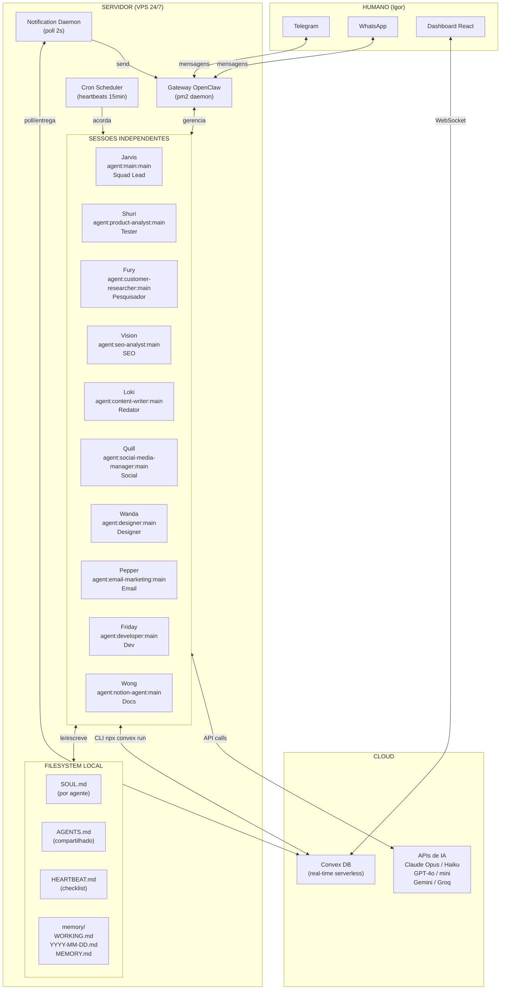

---

## 2. Anatomia de um Agente (Workspace)

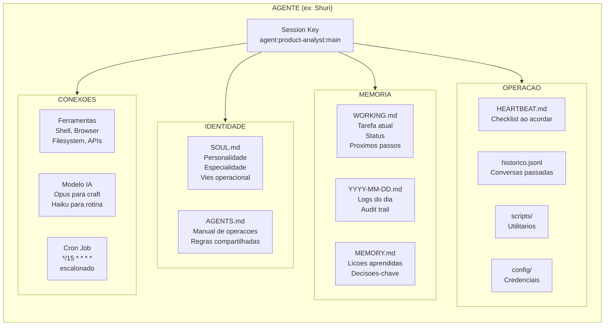

---

## 3. Fluxo do Heartbeat (Ciclo de Vida do Agente)

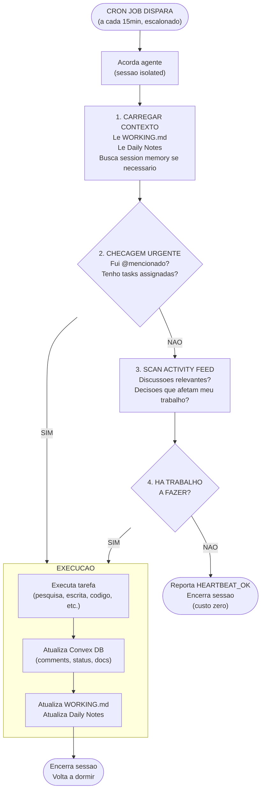

---

## 4. Escalonamento dos Heartbeats (Timeline 15min)

```mermaid
gantt
    title Escalonamento de Heartbeats (ciclo de 15 minutos)
    dateFormat mm
    axisFormat %M min

    section Pepper
    Heartbeat :p1, 00, 2m

    section Shuri
    Heartbeat :s1, 02, 2m

    section Friday
    Heartbeat :f1, 04, 2m

    section Loki
    Heartbeat :l1, 06, 1m

    section Wanda
    Heartbeat :w1, 07, 1m

    section Vision
    Heartbeat :v1, 08, 2m

    section Fury
    Heartbeat :fu1, 10, 2m

    section Quill
    Heartbeat :q1, 12, 2m
```

---

## 5. Schema do Banco de Dados (Convex — 6 Tabelas)

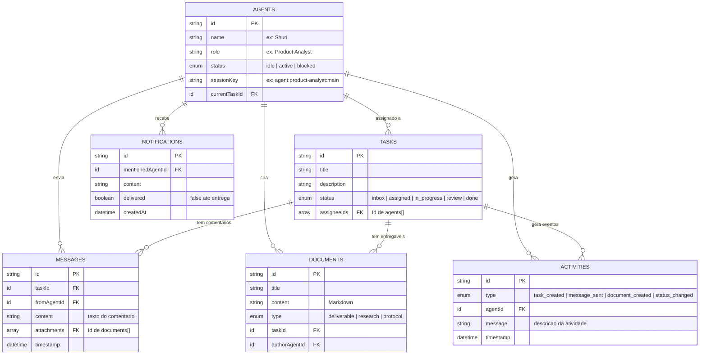

---

## 6. Ciclo de Vida de uma Task (Kanban)

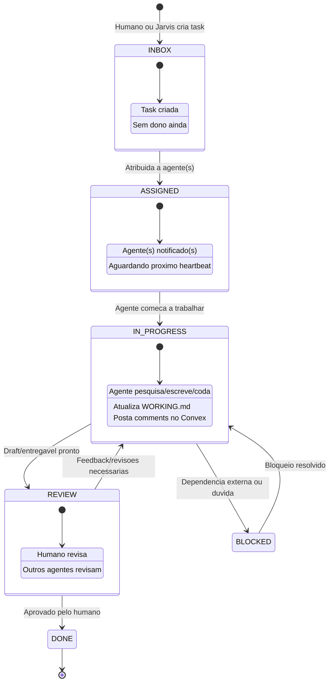

---

## 7. Sistema de Notificacao e @Mentions

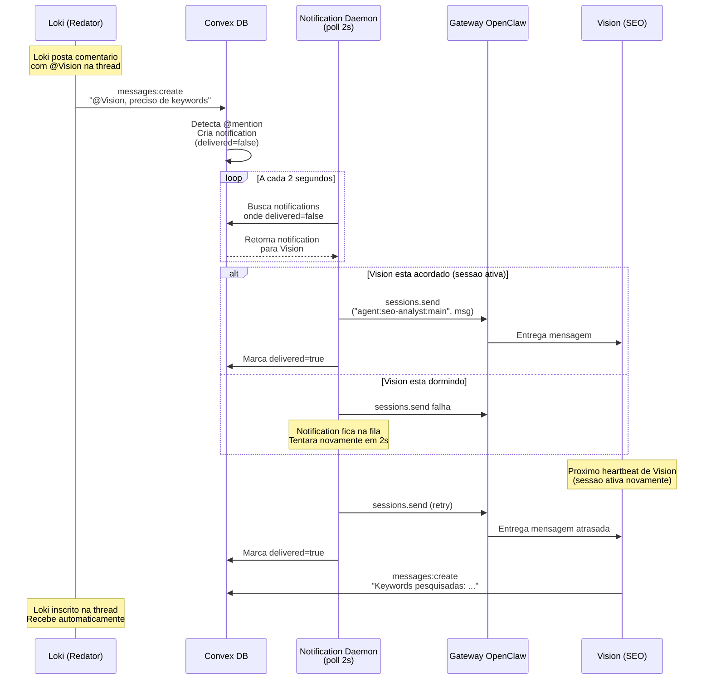

---

## 8. Thread Subscriptions (Inscricao Automatica)

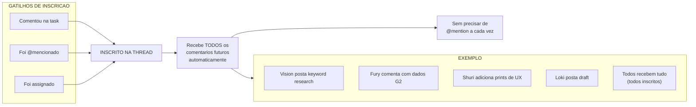

---

## 9. Stack de Memoria (3 Camadas)

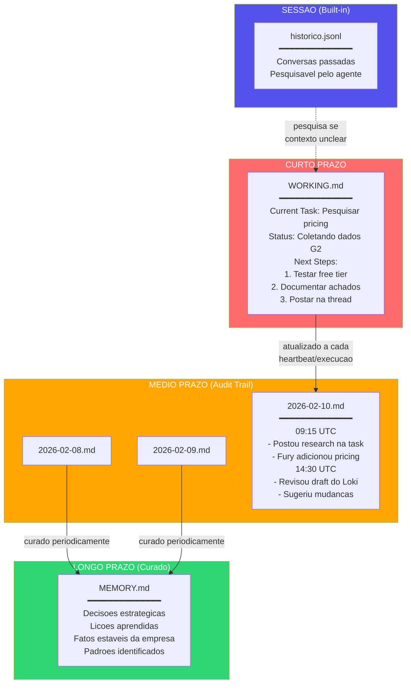

---

## 10. Fluxo Real: Pagina de Comparacao com Concorrente

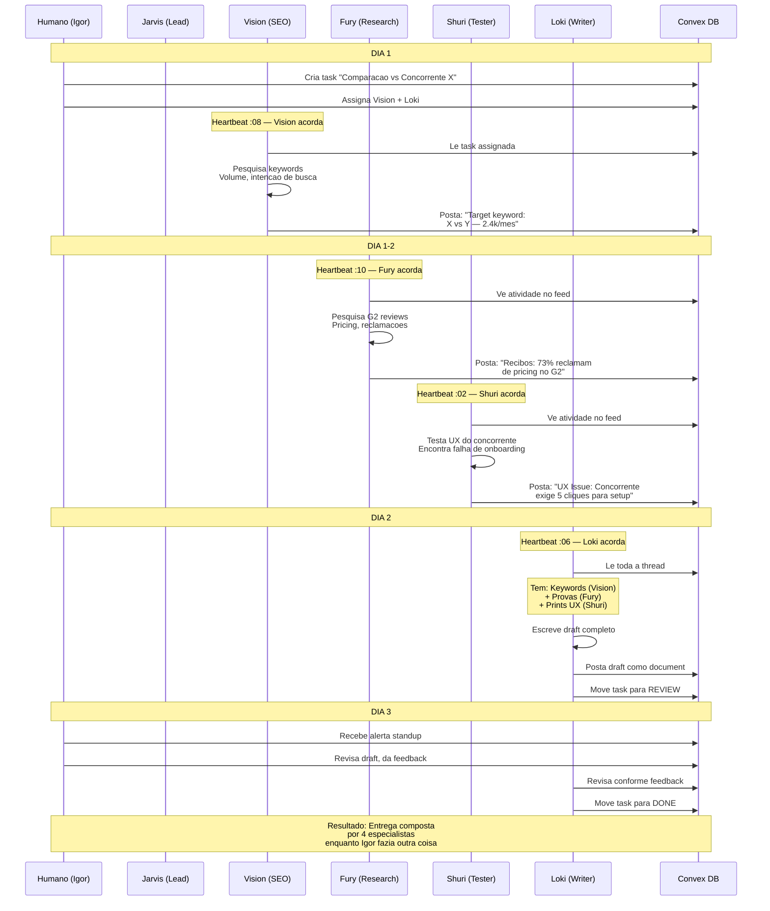

---

## 11. Hierarquia do Squad e Niveis de Autonomia

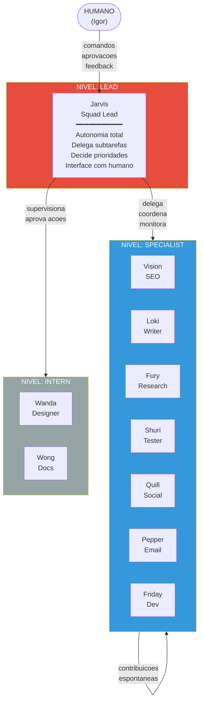

---

## 12. Estrategia de Modelos e Custos

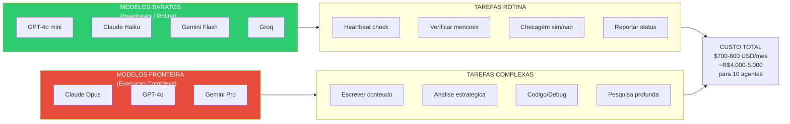

---

## 13. Roadmap de Implantacao (5 Fases)

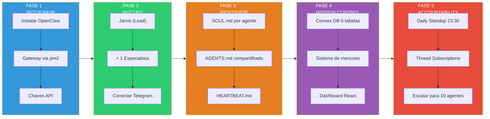

---

## 14. Daily Standup — Fluxo de Compilacao

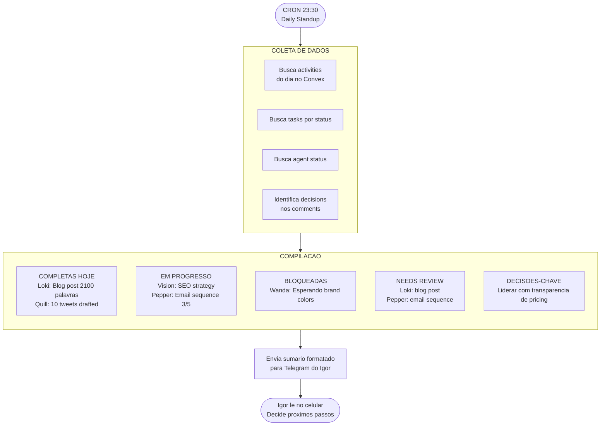

---

## 15. Comunicacao Entre Agentes (2 Canais)

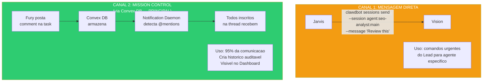

---

## 16. Fluxo de Roteamento do Gateway

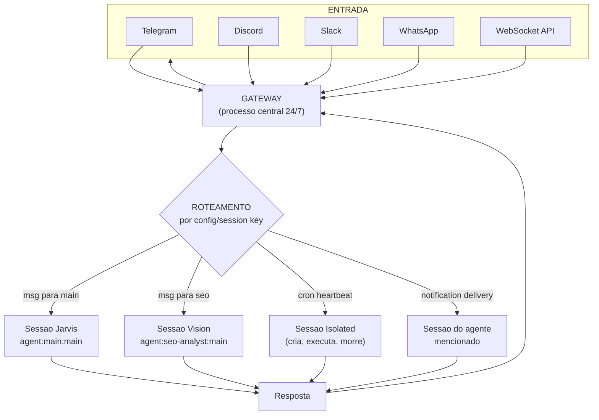

---

*16 diagramas Mermaid cobrindo toda a arquitetura proposta.*
*Renderizar com qualquer visualizador Mermaid (VS Code, GitHub, Notion, mermaid.live)*
